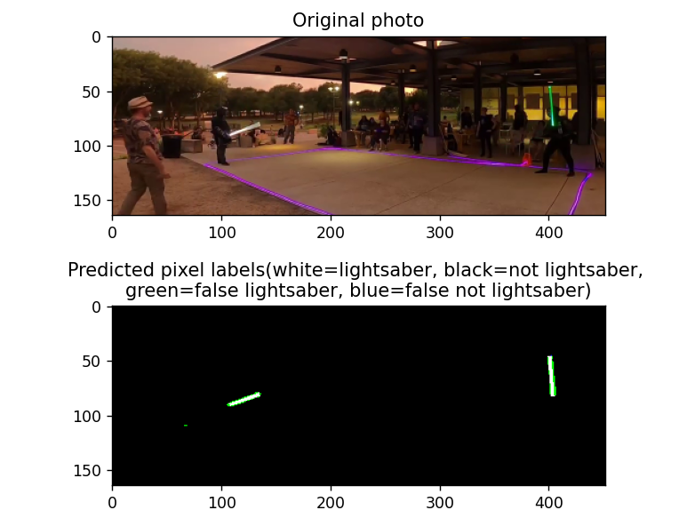

# Lightsaber Detector 🔦🧠  
*A Convolutional Neural Network for Lightsaber Segmentation in Video Duels*



> ⚠️ This is a work-in-progress hobby project to detect lightsabers at the pixel level using deep learning. The goal is to eventually integrate with pose estimation models (e.g., OpenPose) to enable automatic hit detection in live-action lightsaber duels for use in auto-refereeing systems.

---

## Table of Contents
- [Overview](#overview)
- [How to Run](#how-to-run)
- [Model Architecture](#model-architecture)
- [Training Data](#training-data)
- [Training Process](#training-process)
- [Output Visualization](#output-visualization)
- [Requirements](#requirements)
- [License](#license)
- [TODO](#todo)

---

## Overview

This project uses a U-Net convolutional neural network to perform pixel-wise segmentation of lightsabers in video frames. The model is trained on manually annotated footage of mock lightsaber duels and is designed to label only pixels that correspond to lightsabers.

The long-term vision is to combine this model with body segmentation and pose detection frameworks (e.g., OpenPose) to automatically referee duels by identifying valid hits.

---

## How to Run

### Step 1: Extract Lightsaber Duel Footage

```bash
python MAIN_test_label_video_data.py
```

This extracts the segment of the video that contains a lightsaber duel from:

```
data/raw_video_training_test_data/test_footage.mp4
```

---

### Step 2: Label Pixels from Bounding Box Annotations

```bash
python MAIN_test_label_video_frame_data.py
```

This script uses bounding box annotations stored in:

```
data/raw_video_labels/duel_frames_labels_0_to_60.csv
```

It generates pixel-level labels for lightsabers based on the defined quadrilateral regions.

---

### Step 3: Visualize Model Predictions

```bash
python MAIN_run_trained_model.py
```

This visualizes how well the model performs on labeled video data.

---

## Output Visualization

Colors in the visualization represent the following predictions:

| Color  | Meaning                                           |
|--------|---------------------------------------------------|
| White  | Correctly predicted lightsaber pixels             |
| Black  | Correctly predicted non-lightsaber pixels         |
| Blue   | Missed lightsaber pixels (false negatives)        |
| Green  | Incorrectly predicted non-lightsaber pixels (false positives) |

---

## Model Architecture

The model uses a [U-Net architecture](https://arxiv.org/abs/1505.04597), originally developed for biomedical image segmentation (e.g., cells in microscope images). In this project, it's adapted to identify lightsaber pixels instead.

> ⚠️ Note: The model does not preserve the original input image dimensions. Input frames are cropped from **636×348** to **452×164** during processing.

---

## Training Data

- Frames from duel footage are manually annotated using quadrilaterals to enclose lightsaber regions.
- Only **every 3rd frame** is labeled manually.
- Intermediate frames are interpolated to reduce manual labeling effort while preserving frame continuity.

---

## Training Process

- **Optimizer**: Adam  
- **Learning Rate Scheduler**: Exponential decay  
- **Loss Function**: Weighted cross-entropy loss  

Due to class imbalance (very few lightsaber pixels vs. background), lightsaber pixels are weighted **99x** more in the loss function to improve sensitivity to these rare targets.

---

## Requirements

- Python 3.8+
- PyTorch
- OpenCV
- NumPy
- Matplotlib

Install dependencies with:

```bash
pip install -r requirements.txt
```

_(or create an environment using `environment.yml` if available)_

---

## License

This project is released under the MIT License. See `LICENSE` for more details.

---

## TODO

- [ ] Implement pose detection integration (OpenPose)
- [ ] Add real-time inference pipeline
- [ ] Improve labeling accuracy with custom annotation tool
- [ ] Experiment with data augmentation (brightness, motion blur)
- [ ] Publish pretrained model weights

---

